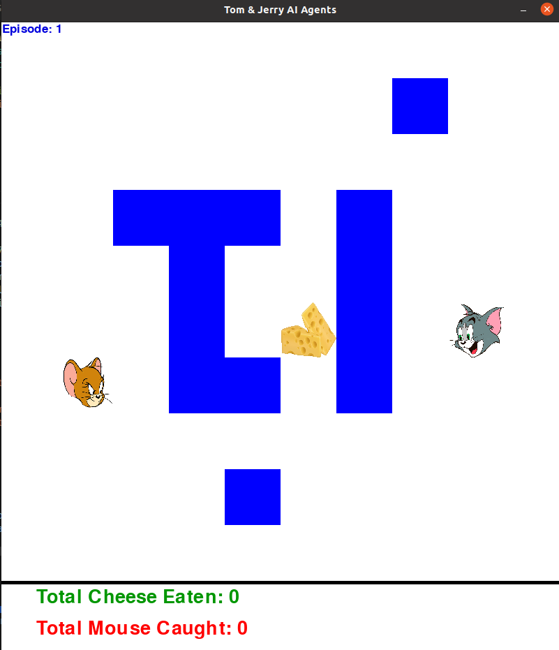

# **Mouse vs Cat | Reinforcement Learning**
This project is an implementation of the classic cat versus mouse problem. I have created 3 possible game instances:
1. the **mouse is an intelligent agent** (must be trained) and the cat is a sentinel and is part of the environment
2. the ***mouse is a smart agent and there are 2 sentry cats** (you can choose two game modes for cats 'misto' or 'verticale'
3. **both agents are intelligent**



The two instances with sentinel cats (1 and 2) are in the appropriate directory `gattoSentinella`. <br>
It is possible to use a fill percentage for obstacles (See directly in the code to understand how it works). <br>
**All implementations are pre-trained and to test them just run the** `main.py` file of each subdirectory (for instances with sentinel cat) or of the root directory (both intelligent agents). <br>
To start the train instead use the `learning.py` file and change the parameters as you want.

Examples for starting the tests:
1. `gattoSentinella/gattoSingolo` -> execute the `main.py` file by entering the mode in **mode** to decide whether to start it with obstacles or not.
2. `gattoSentinella/gattoDoppio`, execute the `main.py` file choosing the mode in **cat2_mode** (the models have been pre-trained with pct_obstacles = 0.04 so you need to retrain if you change the percentage)
3. both smart agents, use the main.py file in the root directory. **Choose the modes in cat_mode ('classic' or 'knowcCheese') and set map_mode ('' or 'walls', if you use walls there is more difficulty for the topo agent)**. The gestione_loop variable is used to tell the system how to manage deadlock situations (See code and comments to understand how it works)

## **Before running the project, prepare the system as follows:**
### Install virtuenv if is not in your system
```bash
pip install virtualenv
```

### Install the virtualenv in the same dir of the project
```bash
virtualenv rl
source rl/bin/activate
```

### Install al the requirements dependencies (file in `utils/` directory)
```bash
pip install -r utils/requirements.txt
```

For other explanation see the report in the `report/` dir. <br>
<br>

*For any problem or help open an issues or contact me: cuccatto7@gmail.com*
